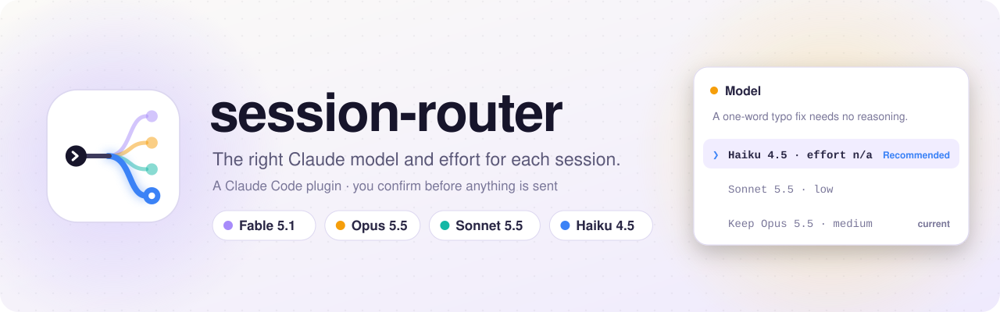

<p align="center">
  <picture>
    <source media="(prefers-color-scheme: dark)" srcset="assets/banner-dark.svg">
    
  </picture>
</p>

<p align="center">
  
  
  
  
</p>

A Claude Code plugin that picks the model and effort for each new session. When you send the first prompt of a session (or the first after `/clear`), Opus 5.5 reads it and recommends the latest Fable, Opus, Sonnet or Haiku and an effort level. It tells you why, and you confirm or override before the prompt is sent. Later prompts are never routed.

```
 Model
 Fixing a one-word typo needs no reasoning. Run this session on Haiku 4.5 · effort n/a?
 ❯ 1. Haiku 4.5 · effort n/a (Recommended)
   2. Sonnet 5.5 · low — if the typo also appears in code
   3. Keep Opus 5.5 · medium (current)
   4. Type something else (e.g. "fable max")
```

The rules come from Anthropic's published model and effort guidance, kept in [one skill](skills/choose-model/SKILL.md). You can also run that skill yourself: `/session-router:choose-model <task>`.

## Install

Needs Claude Code 2.1.289 or later.

```
/plugin marketplace add htxryan/claude-session-router
/plugin install session-router@claude-session-router
```

To try it without installing: `claude --plugin-dir path/to/claude-session-router`.

## Use

- **Skip routing for one session:** start the first prompt with `!!`.
- **See what happened:** `/router`, or the line the plugin adds under your first prompt.
- **Settings** (`/plugin` → session-router): mode `frugal` / `balanced` / `performance`, router model and effort, and phone (Remote Control) behaviour.

It only switches the model for this session. It never runs `/model`, so your saved default stays as it is. Headless runs (`claude -p`) are never routed. In Claude Cowork only the skill is expected to work, not the automatic routing.

[How it works](docs/how-it-works.md) · [Tests and evals](docs/how-it-works.md#tests)
