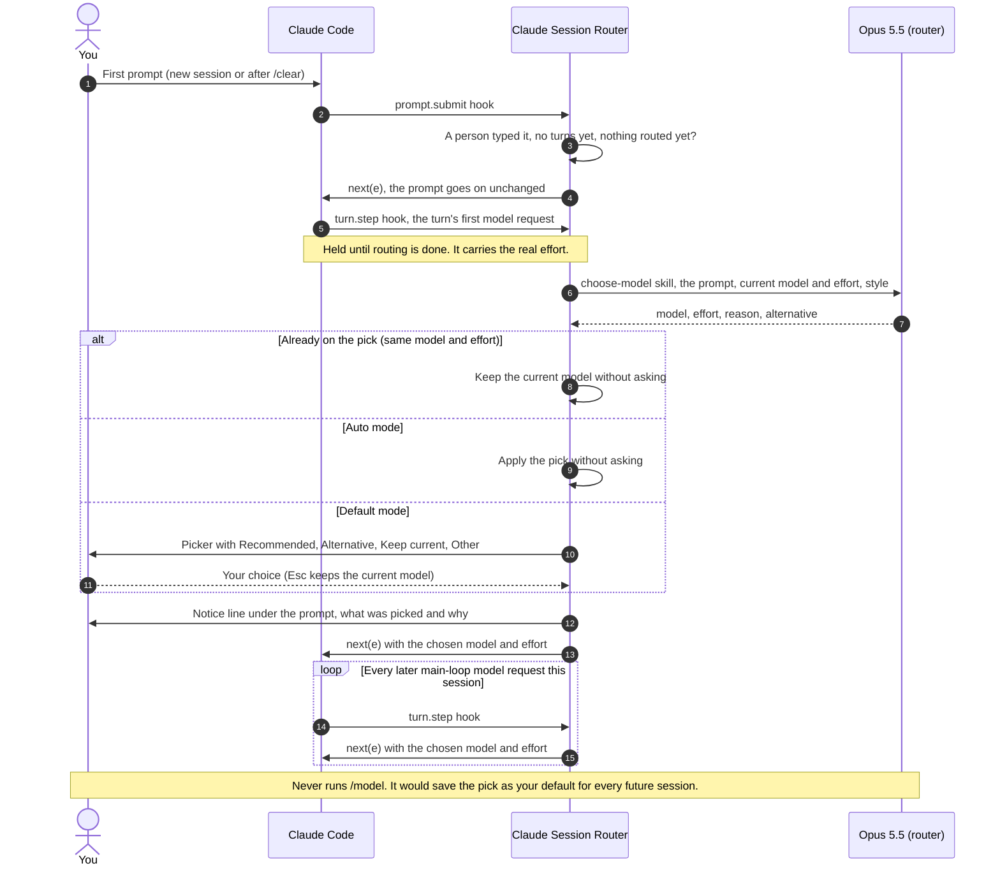

# How it works

## Flow



## When routing happens

Routing runs at the first prompt's first model request, not when you press Enter. Your prompt shows in the transcript, the status line says "routing…", and then the picker opens. The request waits until you choose, then goes out on your choice, so the whole prompt is answered by the routed model.

It waits for that request because of effort. An effort set by `claude --effort` or the desktop app's effort picker isn't visible to plugins when a prompt is submitted, and the request is the first place it shows. Routing earlier would judge against the saved effort. The picker's "Keep … (Current)" would then name the wrong level, and a pick at the saved effort would be skipped as no change when it was one.

- **Esc while routing** cancels the turn and puts your prompt back in the box. Send it again, edited or not, and it is routed.
- **Esc in the picker** keeps the current model and sends the prompt.
- **Skipped prompts** (the `~~` prefix, or `skip` for Remote Control) are noted when their turn starts.
- **Remote Control:** the picker shows on claude.ai or your phone, and the choice there applies the same way.

## The pieces

| File | What it does |
|---|---|
| [`skills/choose-model/SKILL.md`](../skills/choose-model/SKILL.md) | The routing rules, condensed from Anthropic's docs, model announcements and Claude Code blog posts (sources at the end). The router uses it as its system prompt, and you can run it yourself as `/session-router:choose-model <task>`. |
| [`hooks/register.ts`](../hooks/register.ts) | The hooks: catches the first prompt, and at its first model request calls the router, shows the picker and adds the notice line; then rewrites the model and effort on each main-loop request, and answers `/session-router:explain`. |
| [`commands/explain.md`](../commands/explain.md) | Lists `/session-router:explain` under the plugin's name. The hooks answer it directly, so it never reaches the model. |
| [`router/pick.ts`](../router/pick.ts) | Pure logic: the latest model of each family, default efforts, picker labels, parsing the router's JSON, and matching your answer. |
| [`evals/`](../evals) | Prompts with acceptable picks, and a runner that scores the skill. |
| [`tests/`](../tests) | Hook tests run with `claude plugin test`. |

## What the skill recommends

In short, from Anthropic's guidance as of October 2026:

- **Opus 5.5 · medium** by default. Raise the effort to `high` for bug fixes in existing code and edge-case-heavy work. Lower it to `low` for mechanical edits across many files.
- **Sonnet 5.5** for well-scoped work with a clear spec and a way to check the result.
- **Haiku 5.5 · medium** for lookups, short tool tasks and edits that are obviously right or wrong at a glance, not for real coding tasks.
- **Fable 5.1** for long unattended runs, problems with no existing pattern, high-stakes root-cause hunts, or when Opus has already failed. Not for back-and-forth work.

Update the model table in the skill and `LATEST` in `router/pick.ts` when new models ship.

## Tests

```sh
claude plugin validate .
claude plugin test .                                      # 57 tests
npx -y -p typescript@5.6 tsc -p . --noEmit                # type check; needs the plugin loaded once (--plugin-dir) for its types
uv run evals/run.py --runs 5                              # 38 prompts
uv run evals/run.py --runs 5 --probes evals/holdout.json  # 20 held-out prompts
```

The evals call the router the way the plugin does, through `claude -p` on your own login, so they use your plan or credits. A run of 38 prompts × 5 takes about 2 minutes with 8 jobs (`--jobs 8`).

Results on 2026-10-06 (Opus 5.5 at medium as the router):

| Set | Valid JSON | Acceptable pick | Same pick on repeat runs |
|---|---|---|---|
| Main, 38 × 5 | 100% | 100% | 98% |
| Held out, 20 × 5 | 100% | 100% | 96% |

"Acceptable" means the pick was in the probe's range. Most probes accept several reasonable answers, for example Opus or Fable at certain efforts. The held-out prompts were written after the skill was tuned. They include sessions that start on Haiku, Sonnet or Fable, explicit model requests, a prompt-injection attempt, and excluded models.
