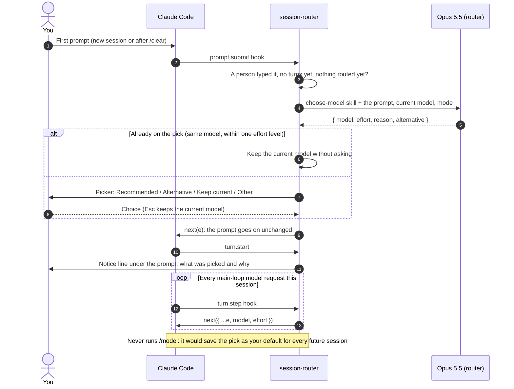

# How it works

## Flow



## The pieces

| File | What it does |
|---|---|
| [`skills/choose-model/SKILL.md`](../skills/choose-model/SKILL.md) | The routing rules, condensed from Anthropic's docs, model announcements and Claude Code blog posts (sources at the end). The router uses it as its system prompt, and you can run it yourself as `/session-router:choose-model <task>`. |
| [`hooks/register.ts`](../hooks/register.ts) | The hooks: catches the first prompt, calls the router, shows the picker, adds the notice line, and rewrites the model and effort on each main-loop request. Adds the `/router` command. |
| [`router/pick.ts`](../router/pick.ts) | Pure logic: the latest model of each family, default efforts, picker labels, parsing the router's JSON, and matching your answer. |
| [`evals/`](../evals) | Prompts with acceptable picks, and a runner that scores the skill. |
| [`tests/`](../tests) | Hook tests run with `claude plugin test`. |

## Decisions

- **Only the first prompt.** Routing happens only when the session has no turns yet and nothing has been routed. The session counts as under way once the model has replied, so commands like `/effort` or `/status` and `!` shell commands before your first prompt don't stop it being routed. A prompt typed while the first turn runs, a second prompt, a resumed session (`--continue`, `--resume`), notifications and this plugin's own commands are never routed. `/clear` starts over. `/resume` of another conversation ends the switch, and that conversation runs on its own model. If you press Esc while it's routing, the prompt is cancelled and is routed again when you resend it.
- **Switched per request, not with `/model`.** Running `/model` from a plugin also saves the choice as your account-wide default. The plugin instead rewrites `model` and `effort` on each main-loop request (`turn.step`). If you pick a model with `/model` (even the one the session started on), the switch ends. If you pick an effort with `/effort`, only the effort part ends and the routed model stays. Opening either and pressing Esc changes nothing, and a request Claude Code sends to a fallback model (after a refusal or an overload) goes to that fallback unchanged. `/model` still shows the session's original model as current, because the switch happens per request.
- **An explicit `--model` still routes.** Starting with `claude --model sonnet` shows the picker as usual, with your model offered as "Keep … (current)". Start the first prompt with `~~` to skip routing.
- **Your current effort** is read the way Claude Code resolves it: `CLAUDE_CODE_EFFORT_LEVEL`, then `modelSettings.<model>.effortLevel`, then a top-level `effortLevel` (which Opus 5.5 and Sonnet 5.5 ignore), then the model's default.
- **Fast mode** only speeds up Opus. When it's on and the pick is another model, the picker says so.
- **Fails open.** If the router errors, times out (30 s) or is refused (for example a `routerModel` you can't use), the prompt is sent on the current model and the notice says so.
- **Skipped** for headless runs (`claude -p`), prompts starting with `~~` (configurable; avoid `!`, which starts shell mode, and `/`, which starts commands), and, if you choose, Remote Control. On the phone the picker shows by default. Setting `remoteMode: auto` applies the pick without asking.
- **Models to never recommend** (`excludeModels`, e.g. `fable`) are listed as off-limits in the router's input. If the router names one anyway, its allowed runner-up takes its place; if there is none, the current model stays. You can still type an excluded model in the picker.
- **Modes** only break ties between close options: `frugal` favours the cheapest model that will finish, and `performance` the more capable one.
- **Where it runs.** Automatic routing needs Claude Code's plugin hooks, and it was tested in the terminal. In Claude Cowork the skill is expected to work through the same plugin format, but automatic routing is untested and probably doesn't run.

## What the skill recommends

In short, from Anthropic's guidance as of October 2026:

- **Opus 5.5 · medium** by default. Raise the effort to `high` for bug fixes in existing code and edge-case-heavy work. Lower it to `low` for mechanical edits across many files.
- **Sonnet 5.5** for well-scoped work with a clear spec and a way to check the result.
- **Haiku 4.5** for lookups and edits that are obviously right or wrong at a glance, not for writing real code.
- **Fable 5.1** for long unattended runs, problems with no existing pattern, high-stakes root-cause hunts, or when Opus has already failed. Not for back-and-forth work.

Update the model table in the skill and `LATEST` in `router/pick.ts` when new models ship. Haiku 5.5 is announced as coming soon.

## Tests

```sh
claude plugin validate .
claude plugin test .                                      # 36 tests
uv run evals/run.py --runs 5                              # 38 prompts
uv run evals/run.py --runs 5 --probes evals/holdout.json  # 20 held-out prompts
```

The evals call the router the way the plugin does, through `claude -p` on your own login, so they use your plan or credits. A run of 38 prompts × 5 takes about 2 minutes with 8 jobs (`--jobs 8`).

Results on 2026-10-06 (Opus 5.5 at medium as the router):

| Set | Valid JSON | Acceptable pick | Same pick on repeat runs |
|---|---|---|---|
| Main, 38 × 5 | 100% | 100% | 98% |
| Held out, 20 × 5 | 100% | 100% | 96% |

"Acceptable" means the pick was in the probe's range. Most probes accept several reasonable answers, for example Opus or Fable at certain efforts. The held-out prompts were written after the skill was tuned. They include sessions that start on Haiku, Sonnet or Fable, explicit model requests, a prompt-injection attempt, and excluded models.

## Known limits

- **Subagents keep the session's original model.** Subagents that inherit the main model, including the built-in Explore agent, run on the model the session started with, not the routed one. Subagents with their own `model` setting are unaffected.
- **`/effort` saves to the original model.** In a routed session, Claude Code saves `/effort` as the default effort for the model the session started with, for example Opus, even though the routed model is what uses it.
- **A bad value in settings stops the plugin loading.** If `pluginConfigs` in `settings.json` is edited by hand and a field has the wrong type, such as text for `timeoutMs`, Claude Code doesn't load the plugin, and the error only appears in the debug log. Setting options through `/plugin` avoids this.
- **"Chat about this" in the picker** keeps the current model, the same as Esc.
- **Typed answers in the picker** are read for a model and an effort ("sonnet low", "not opus, use sonnet", or just "low" for the recommended model at low effort). When an answer names several models, the last one counts ("fable is overkill, use opus"). Anything else keeps the current model.
- **An `--effort` flag isn't visible to plugins.** If you start with `claude --effort max`, the picker shows your saved effort as the current one. The flag itself still applies if you keep the current model.
- **Context size follows the original model.** Claude Code plans compaction for the model the session started with. A long session routed from a 1M-context Opus session to Haiku 4.5 (200k) may reach Haiku's limit before Claude Code compacts.
- **Ctrl+C doesn't close the picker.** Use Esc.
- **Type-ahead.** Text you type while the router is working stays in the prompt box. It isn't sent as part of the first prompt.
